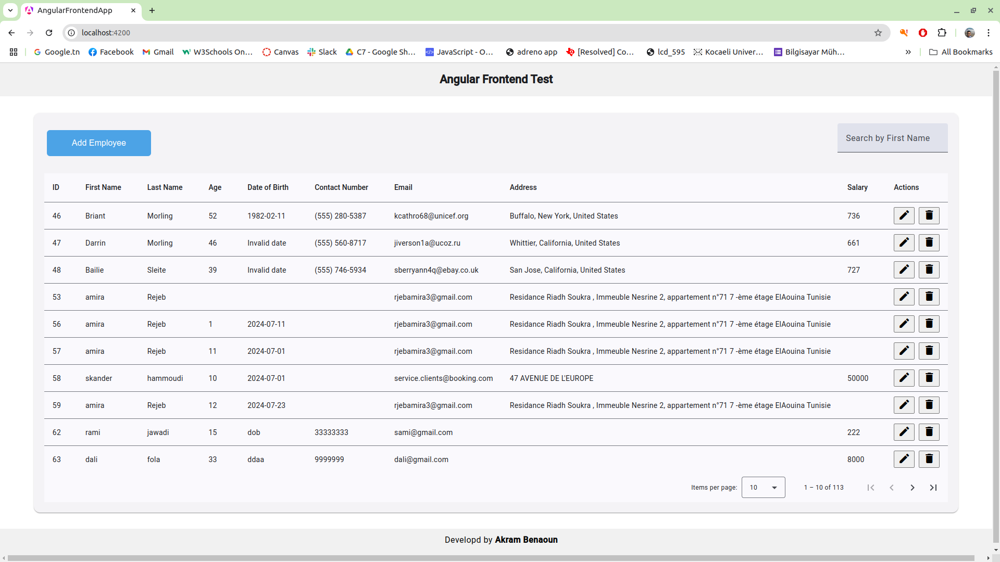
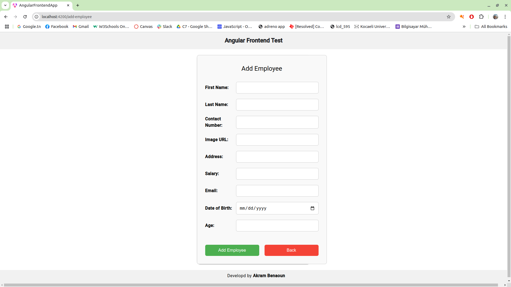
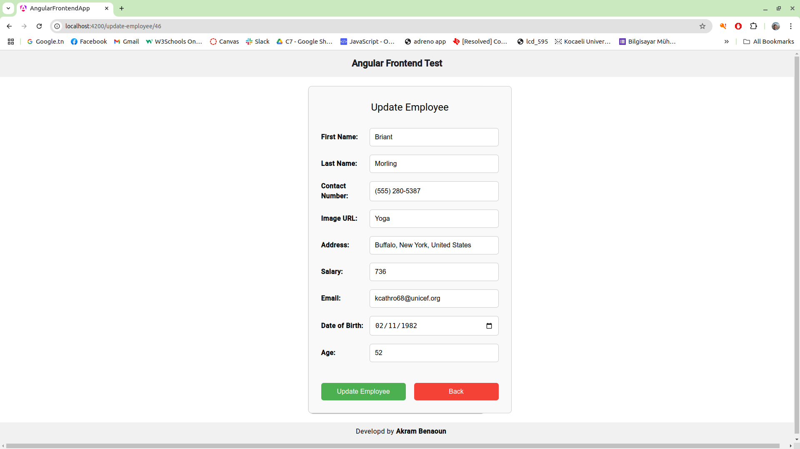
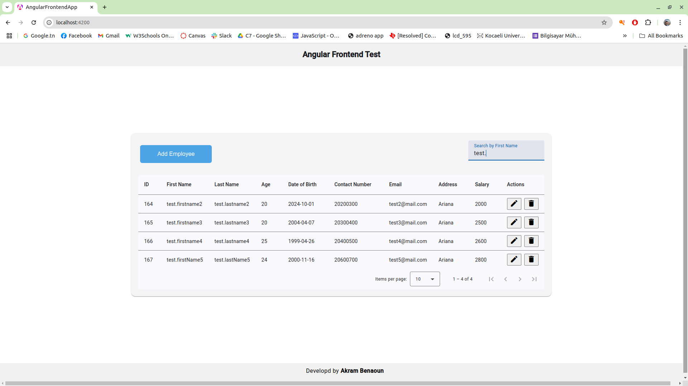

# ANGULAR FRONTEND TEST APPLICATION:

##Specs:
* Node Version: v20.18.0
* NPM Version: 10.9.0
* Angular Version: 18.2.10

##Installation:
* you can clone the project repo (main branch) ====> git clone https://github.com/akramBNA/angular-frontend-app.git
* npm install

##Run:
* to run the app: npm start or ng serve

##Technologies used:
* Angular 18
* Node 10 (NPM)
* Angular Material

##About this project:
this is a Angular (18.2.10) frontend application: it retrievs data from a dummy data API (https://retoolapi.dev/HYd96h/data) and perform these operations:
* show data on table
* pagination: initially show 10 per page
* add data (employee)
* update data
* delete data
* search data by first name
* sort column data (not quite finished)
* responsive design for width less/above 600px
* the stoe (NGRX) is not used!

##Project duration:
* 1 day

##ScreenShots:

